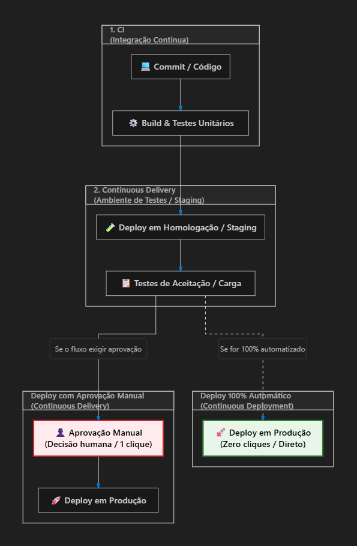

# DevOps

> Item **6** ("DevOps") do bloco *Desenvolvimento de Sistemas*, Módulo II — Perfil 3, do Anexo I do edital DATAPREV 2026. Corresponde ao item **10** na numeração contínua da ementa.

> **Fontes primárias deste texto:** Fowler, *Continuous Integration* (2024) e *ContinuousDelivery*; Humble & Farley, *Continuous Delivery* (Addison-Wesley, 2010), cap. 1; Humble, *Continuous Delivery vs Continuous Deployment* (2010); Wilsenach, *DevOpsCulture* (2015); NIST SP 800-204C (2022). Arquivadas em `fontes-gabaritos/devops/`.

---

## 1. O que é DevOps

DevOps é uma **cultura, filosofia e conjunto de práticas** que unifica o desenvolvimento de software (Dev) e as operações de TI (Ops), visando encurtar o ciclo de vida do desenvolvimento e entregar software com alta frequência, qualidade, segurança e confiabilidade.

O movimento nasceu para **remover os silos** entre requisitos, desenvolvimento, teste, implantação, operação e manutenção — atividades que a organização tradicional separava em times distintos, com repasse de trabalho "por cima do muro" entre eles.

### 1.1 DevOps é cultura, não um conjunto de ferramentas

Esta é a fronteira que a banca explora. A formulação da fonte é literal:

> *"DevOps has become possible largely due to a combination of new operations tools and established agile engineering practices, but **these are not enough** to realize the benefits of DevOps. **Even with the best tools, DevOps is just another buzzword if you don't have the right culture.**"*
> — Rouan Wilsenach, *DevOpsCulture* (martinfowler.com, 2015)

O que **nenhuma ferramenta instala**:

* **Colaboração entre os papéis de desenvolvimento e operação** — a característica primária da cultura DevOps. Não é um cargo nem um time: é o modo como os papéis existentes trabalham juntos.
* **Responsabilidade compartilhada** pelo sistema em produção, ao longo de toda a sua vida. O desenvolvedor não termina quando entrega o código ao time de testes; termina quando **funciona em produção**. Em contrapartida, quem opera passa a compartilhar os objetivos de negócio do sistema.
* **Times autônomos**, com poder de decidir e aplicar mudanças sem processos de aprovação tortuosos.
* **Ambiente livre do medo de falhar** — falha tratada como aprendizado, não como culpa. Repasses e assinaturas de aprovação (*sign-offs*) desestimulam a responsabilidade compartilhada e alimentam a cultura da culpa.
* **Valorizar o feedback** e **construir qualidade desde o início** (*build quality in*), incluindo os requisitos transversais de desempenho e segurança.

### 1.2 Qual é, então, o papel das ferramentas

Automação **é** pilar do movimento: viabiliza a colaboração, libera as pessoas para atividades de mais valor, reduz erro humano e ainda serve como documentação sempre atualizada do sistema. Virtualização, computação em nuvem, gestão de configuração automatizada e integração contínua são o que tornou o DevOps possível.

A relação correta é: **automação é condição necessária, mas não suficiente**.

### 1.3 Dois antipadrões

* **Criar o cargo "DevOps" ou um "time de DevOps".** Isso **recria exatamente o silo** que o movimento nasceu para derrubar, e impede a cultura de se espalhar pela organização.
* **Confundir DevOps com CI/CD.** Esteira é técnica; DevOps inclui a dimensão cultural. **Nem toda equipe com pipeline faz DevOps.**

> **DevSecOps** é o mesmo paradigma com ênfase explícita no papel do time de segurança — teste de segurança ao longo de todo o ciclo e monitoramento contínuo em execução (NIST SP 800-204C).

---

## 2. Diagrama de CI/CD



---

## 3. Integração Contínua (*Continuous Integration* — CI)

**Definição (Fowler, 2024):**

> *"Continuous Integration is a software development practice where **each member of a team merges their changes into a codebase together with their colleagues changes at least daily**. Each of these integrations is **verified by an automated build (including test)** to detect integration errors as quickly as possible."*

Três elementos compõem a definição, e **todos** são cobráveis:

1. **Cada membro da equipe** integra na *mainline* versionada compartilhada — não é "integrar de vez em quando", é toda a equipe.
2. **Ao menos uma vez por dia** (*at least daily*). É critério objetivo, não "com frequência".
3. Cada integração é **verificada por um build automatizado que inclui os testes**.

### 3.1 O problema que a CI ataca

A **integração tardia**. Quanto mais tempo o trabalho de cada desenvolvedor fica sem integrar, mais os ramos divergem e mais caro e imprevisível fica o merge — o chamado *merge hell*. Fowler abre o artigo com o caso de uma equipe que programou por dois anos e passou meses integrando, sem que ninguém soubesse dizer quando terminaria.

A CI ataca isso invertendo a lógica: integrar **muitas vezes, em pedaços pequenos**, de modo que cada conflito seja detectado quando ainda é pequeno.

### 3.2 O papel dos testes unitários

O build da CI não é só compilar. Fowler chama a prática de **build autotestável** (*Make the Build Self-Testing*):

* A verificação principal é uma **suíte abrangente de testes automatizados**, executada a cada integração — e o núcleo dela são os **testes unitários**, escritos em frameworks da família xUnit (JUnit, o mais influente deles).
* **Qualquer teste que falhe reprova o build inteiro**: *"99.9% green is still red"*.
* No *deployment pipeline* de Humble & Farley (Figura 1.1), o **estágio de commit** é justamente `compilar → testes unitários → análise estática → gerar instaladores`. É o primeiro portão, o mais rápido e o mais barato.
* Código autotestável é **pré-requisito** da CI: sem testes decentes não há como manter a base saudável. O maior obstáculo prático para adotar CI costuma ser falta de habilidade em testes.
* TDD não é obrigatório para fazer CI — os testes podem ser escritos depois do código de produção, desde que **antes da integração**.

### 3.3 As práticas da CI

* Manter tudo em uma ***mainline* única sob controle de versão**
* **Automatizar o build**
* **Tornar o build autotestável**
* **Todos empurram commits para a mainline todo dia**
* **Todo push para a mainline dispara um build**
* **Consertar build quebrado imediatamente**
* **Manter o build rápido**
* Testar em um clone do ambiente de produção
* Deixar visível para todos o que está acontecendo
* Automatizar a implantação

### 3.4 Fronteira

A CI trata de **integrar, construir e testar dentro do ambiente de desenvolvimento**. Ela **não** é a prática que publica em produção — seu artefato é uma *build integrada e verificada*, não um pacote pronto para o usuário.

---

## 4. Entrega Contínua (*Continuous Delivery*)

**Definição (Fowler):**

> *"Continuous Delivery is a software development discipline where you build software in such a way that the software **can be released to production at any time**."*

É a resposta correta para o enunciado *"fornecer rapidamente uma nova versão ao ambiente de produção com o mínimo de interrupção para os usuários"* — foi assim que a FGV cobrou na DATAPREV 2024 (questão 55, gabarito **B**).

### 4.1 Os quatro indicadores de que você está fazendo entrega contínua

1. O software é **implantável ao longo de todo o seu ciclo de vida**.
2. A equipe **prioriza manter o software implantável** sobre trabalhar em novas funcionalidades.
3. **Qualquer pessoa obtém feedback automatizado e rápido** sobre a prontidão para produção, sempre que alguém muda algo.
4. É possível fazer **implantação em botão** (*push-button deployment*) de **qualquer versão** para **qualquer ambiente**, sob demanda.

> **O teste definitivo (Fowler):** um patrocinador do negócio poderia pedir que a versão atual de desenvolvimento fosse para produção **num piscar de olhos** — e ninguém entraria em pânico.

### 4.2 O que a entrega contínua automatiza

Os **estágios finais rumo à produção**, que a CI não cobre: promoção do artefato por ambientes progressivamente mais parecidos com produção, testes de aceitação automatizados, testes de capacidade e a implantação em si.

Seu artefato é um ***release candidate* versionado e implantável** a qualquer momento.

### 4.3 O que ela exige

* Uma **relação de trabalho próxima e colaborativa** entre todos os envolvidos na entrega — a cultura DevOps (e isso vai além de dev e ops: inclui testadores, DBAs e quem mais for preciso).
* **Automação extensiva** de todas as partes possíveis do processo de entrega, geralmente via *deployment pipeline*.

---

## 5. Implantação Contínua (*Continuous Deployment*)

**Definição (Fowler):**

> *"Continuous Deployment means that **every change goes through the pipeline and automatically gets put into production**, resulting in many production deployments every day."*

Humble observa que o nome mais exato teria sido ***continuous release***: a prática é **liberar aos usuários toda build boa**.

---

## 6. A fronteira entre as três — é aqui que a banca monta o distrator

### 6.1 A diferença é *quem aciona a subida*, não *o que está automatizado*

> *"Continuous Delivery just means that you are **able** to do frequent deployments but **may choose not to do it**, usually due to businesses preferring a slower rate of deployment."*
> — Fowler

O grau de automação de build e teste é o **mesmo** nas duas. O que muda é o gatilho da subida:

| | Entrega Contínua | Implantação Contínua |
|---|---|---|
| **Estado do artefato** | sempre liberável | sempre liberável |
| **Quem decide subir** | **pessoa / negócio** | **a própria esteira**, automaticamente |
| **O que vai a produção** | o que o negócio escolher, quando escolher | **toda** mudança que passa no pipeline |

> *"Continuous delivery is about putting the **release schedule in the hands of the business, not in the hands of IT** (…) that any build could potentially be released to users **at the touch of a button**."*
> — Jez Humble

### 6.2 A relação é de continência, não de alternativa

```
Integração Contínua ⊂ Entrega Contínua ⊂ Implantação Contínua
```

* *"**In order to do Continuous Deployment you must be doing Continuous Delivery.**"* (Fowler)
* *"While continuous deployment implies continuous delivery **the converse is not true**."* (Humble)

O distrator típico apresenta as três como **escolhas paralelas**, ou **inverte a implicação**.

### 6.3 CI × Entrega Contínua: o que automatiza e que artefato produz

| | Integração Contínua | Entrega Contínua |
|---|---|---|
| **Automatiza** | integrar na mainline, compilar e rodar os **testes unitários** do estágio de commit | promoção por ambientes *production-like*, testes de aceitação e capacidade, e a implantação |
| **Onde opera** | **ambiente de desenvolvimento** | caminho até a **produção** |
| **Artefato** | **build integrada e verificada** (mainline verde) | ***release candidate* versionado e implantável** |
| **Efeito** | mainline sempre saudável | **liberar vira decisão de negócio** |

> *"Continuous Integration usually refers to integrating, building, and testing code **within the development environment**. Continuous Delivery builds on this, dealing with the final stages required for production deployment."* — Fowler

### 6.4 Cuidado com a sigla "CD"

Em inglês, **CD** serve tanto para *continuous delivery* quanto para *continuous deployment* — e é exatamente aí que a banca constrói o erro. **Escreva sempre por extenso, em português.**

---

## 7. O *deployment pipeline*

É o mecanismo que liga a CI à entrega contínua. Cada mudança em código, configuração, ambiente ou dados **dispara uma nova instância do pipeline**, e o *release candidate* atravessa uma sequência de estágios — **cada estágio é um portão**, e cada teste vencido aumenta a confiança de que aquela combinação de binário, configuração, ambiente e dados funciona.

O pipeline canônico de Humble & Farley (Figura 1.1):

```
Commit stage          →  Automated        →  Manual       →  Automated   →  Release
 compilar                acceptance          testing         capacity
 testes unitários        testing             (exploratório,  testing
 análise estática                             showcases)
 gerar instaladores
```

**Por que os testes rápidos vêm primeiro:** os primeiros estágios rodam depressa e em hardware barato; se falham, o candidato não avança e nada mais é gasto com ele.

**Os três objetivos do pipeline:**

1. Tornar **visível a todos** cada parte de construir, implantar, testar e liberar.
2. **Melhorar o feedback**, para que os problemas apareçam o mais cedo possível.
3. Permitir implantar e liberar **qualquer versão em qualquer ambiente**, por processo totalmente automatizado.

---

## 8. Os habilitadores da esteira — e por que nenhum deles *é* a esteira

Estes três aparecem como distratores clássicos da questão *"que prática publica nova versão em produção com mínima interrupção?"*. São **pré-requisitos e realimentação** da esteira — **nenhum deles publica coisa alguma**.

### 8.1 Controle de versão

O repositório que guarda o **histórico de toda mudança em todo artefato**, permitindo recuperar qualquer estado anterior e rastrear autoria. Princípio de Humble & Farley: **"mantenha absolutamente tudo sob controle de versão"** — não só o código-fonte, mas scripts de build, configuração e o que mais for preciso.

*Opera antes e durante a construção.* É a base de tudo o mais, mas por si só não leva nada a produção.

### 8.2 Gerenciamento de configuração

O controle **versionado e automatizado** sobre tudo que é preciso para **construir, implantar, testar e liberar** a aplicação: código-fonte, scripts de build, configuração da aplicação e configuração dos ambientes (sistema operacional, nível de patches, pilha de software, rede, infraestrutura).

O critério é **poder recriar qualquer ambiente de forma repetível**, preferencialmente automatizada. O antipadrão correspondente é a *configuração manual dos ambientes de produção* — cada mudança feita à mão, sem registro nem teste.

*Opera antes e durante a construção.* Prepara o terreno para a publicação; não é a publicação.

### 8.3 Monitoramento contínuo

A observação do **estado de execução do sistema em produção** — métricas, logs, *tracing*, alertas — realimentando a equipe. No NIST SP 800-204C aparece como *observability as code*: a instrumentação declarada como código, relatando o estado de execução a ferramentas de métrica, agregação de log e *tracing*, consolidadas num painel.

*Opera **depois** da subida.* Diagnostica e realimenta; não publica.

### 8.4 O resumo cobrável

| Conceito | Quando opera | O que faz | Publica versão? |
|---|---|---|:-:|
| Controle de versão | antes / durante | histórico e rastreabilidade de todo artefato | ❌ |
| Gerenciamento de configuração | antes / durante | reprodutibilidade de build e de ambiente | ❌ |
| Monitoramento contínuo | **depois** | feedback do sistema em execução | ❌ |
| **Entrega Contínua** | **o caminho até a produção** | **mantém o software liberável a qualquer momento** | ✅ |

---

## 9. Estudo de caso: classificar uma esteira

> Uma equipe integra e testa a cada commit, gera artefato versionado e o mantém sempre pronto para produção, mas a subida para produção depende de aprovação manual do gerente.

**Classificação:**

* **Integração Contínua: ✅ presente.** Integra e testa a cada commit.
* **Entrega Contínua: ✅ presente e plena.** O artefato é versionado e está sempre pronto para produção — poderia subir a qualquer momento.
* **Implantação Contínua: ❌ ausente.** Nela, toda build aprovada iria a produção **automaticamente**, sem intervenção humana.

**O ponto contraintuitivo:** a aprovação do gerente **não é defeito nem imaturidade da esteira**. É a entrega contínua **funcionando exatamente como definida** — *"able to do frequent deployments but may choose not to do it"*. O calendário de release está nas mãos do negócio, que é o objetivo declarado da prática. Uma esteira assim não está "a meio caminho" de nada: ela está completa no que se propõe.

**E se a equipe quisesse adotar Implantação Contínua?** A mudança seria uma só: **remover o portão manual**, transferindo para a esteira a decisão de liberar. Não é acrescentar automação de build ou de teste — essas já existem. Isso reforça o ponto da seção 6.1: o que separa uma prática da outra é **quem aciona a subida**, não o grau de automação. Mas é uma **escolha de negócio**, não a correção de uma falha.

---

## 10. O que já caiu

**FGV / DATAPREV 2024 — questão 55** (Analista de TI, Desenvolvimento de Software):

> *No contexto de DevOps, o conceito que descreve única e corretamente a prática de fornecer rapidamente uma nova versão de software ao ambiente de produção com o mínimo de interrupções para os usuários é chamado*
> (A) Integração Contínua (CI).
> (B) Entrega Contínua (CD).
> (C) Gerenciamento de Configuração.
> (D) Monitoramento Contínuo.
> (E) Controle de Versão.

**Gabarito oficial: (B).** Note a construção: a alternativa (A) é o conceito **vizinho** (opera no ambiente de desenvolvimento, não publica), e (C), (D) e (E) são os **habilitadores** da seção 8 — todos reais, todos parte de uma esteira, nenhum deles a prática que publica.
